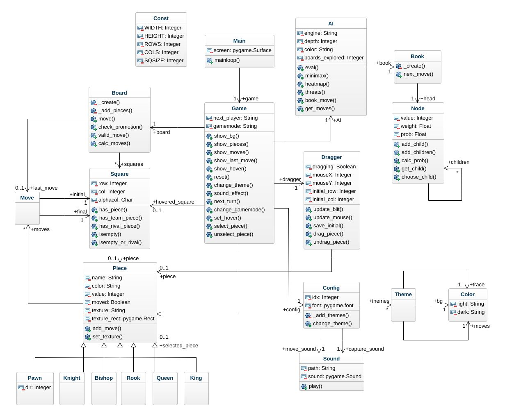

# Chess AI

A Python-based Chess AI with customizable game modes, AI depth, and themes.


## Instructions

### Entry Point
- Run the game using `main.py`.

### Controls
- **Change Game Mode**: Press the key `a` to toggle between Player vs. Player (PVP) and Player vs. AI modes.
- **Change AI Depth**: Adjust the AI difficulty by pressing the keys `3` or `4`.
- **Change Theme**: Press the key `t` to cycle through different themes (green, brown, blue, grey, cs).
- **Restart Game**: Press the key `r` to restart the game.

## How to Run
1. Ensure you have Python installed.
2. Clone the repository.
3. Run the game:
    ```sh
    python main.py
    ```

## Technical Details
The AI uses alpha-beta pruning with adjustable depth settings, providing a challenging and customizable chess experience.

## Contributing
Contributions are welcome! Fork the repository, make your changes, and submit a pull request.

## License
This project is licensed under the MIT License. See the `LICENSE` file for details.

## Contact
For questions or feedback, please reach out to [yoonusk2001@gmail.com](mailto:yoonusk2001@gmail.com).

